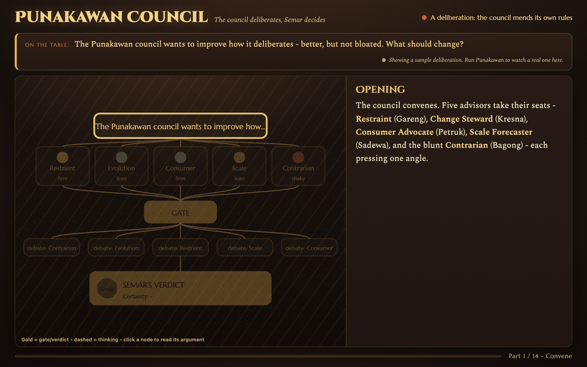

# Punakawan - a panel of expert advisors for Claude Code

> A wayang-inspired panel of Claude "lenses" that debate your hard technical
> calls and return one sharp verdict - entirely in-session, nothing leaves your
> machine.


**Punakawan** is a [Claude Code](https://claude.com/claude-code) plugin. When you
face a real trade-off - *"split this service or not?"*, *"is this
over-engineered?"*, *"event-sourced vs CRUD?"* - it convenes a few Claude
sub-agents, each arguing one expert perspective, runs a short structured debate,
and hands back a single decision with a certainty band and the *real* shape of
the disagreement.

Named after the **Punakawan**, the wise advisor-clowns of Javanese *wayang*. Their
leader **Semar** is the synthesizer who renders the final judgment.



> An optional [browser simulation](#optional-the-wayang-simulation) replays a deliberation as an autoplaying node-graph - the lenses opine, the gate decides whether to debate, and Semar's verdict lands last.

---

## Why a panel - and why not just "ask the model to critique itself"?

Fair question. Every voice here is the *same* underlying model with a different
persona prompt, so they are **not independent estimators**. The value is not a
vote - it's:

- **Coverage.** Distinct lenses (a threat modeler, a restraint keeper, a scale
  forecaster, a contrarian, …) light up *different* failure modes. A question
  framed as "cost" still gets its threat and evolution angles surfaced.
- **A forced argument.** A second round makes the lenses critique each other and
  revise - this is where blind spots and over-engineering actually get caught.
- **Anti-groupthink insurance.** A standing skeptic is always seated, and even
  when everyone agrees, one mandatory "why might we all be wrong together?" pass
  runs.

Because the voices share one model, Punakawan **never tallies or averages votes**
("4 of 5 agree" is *one framing repeated*, not evidence), caps the panel at 5,
and leans on a sharp synthesis instead of headcount.

**Honest scope:** this is a sharp tool for genuinely hard calls, not a thing to
run on every question. For a one-dimensional question it tells you so and answers
directly. It costs several sub-agent dispatches - spend them on decisions worth
the deliberation.

## Install

Punakawan is a Claude Code **plugin**, installed from its own marketplace (this
repo). In Claude Code:

```
/plugin marketplace add ecowangsa/punakawan
/plugin install punakawan@punakawan
```

Start a new session and the panel is available.

> **Upgrading from the old standalone skill?** Earlier it was installed by
> `git clone`-ing into `~/.claude/skills/punakawan`. Remove that copy first so it
> doesn't shadow the plugin, then run the two commands above:
> ```sh
> rm -rf ~/.claude/skills/punakawan
> ```

### Staying up to date

Because this is a third-party marketplace, Claude Code won't pop up an update
notice on its own (that automatic check is reserved for official Anthropic
marketplaces). To see whether a newer version exists and pick it up, refresh the
catalog and open the plugin manager:

```
/plugin marketplace update punakawan
/plugin
```

The `/plugin` manager shows your installed version against what's available; apply
the update there, then `/reload-plugins` (or restart). Newer Claude Code builds
also accept the one-shot `/plugin update punakawan@punakawan`. The current version
is the `version` field in [`.claude-plugin/plugin.json`](.claude-plugin/plugin.json);
see [`CHANGELOG.md`](CHANGELOG.md) for what changed.

## Use

Plugin skills are namespaced `plugin:skill`, so the typed command is
**`/punakawan:panel`**. The plain-language trigger is unaffected - Claude picks the
panel up from its description, exactly as before. Invoke it any of these ways:

- **In plain language** (the normal case) - describe the trade-off and name the
  panel; Claude convenes it on its own:
  ```
  Should we move auth into its own service, or keep it in the monolith? Ask the punakawan.
  ```
- **Explicitly**, with the namespaced command:
  ```
  /punakawan:panel should we move auth into its own service, or keep it in the monolith?
  ```
- **Bare, right after a `brainstorming` session offered you approaches** -
  Punakawan reads the fork from the conversation, so you don't retype it:
  ```
  /punakawan:panel
  ```
- **`/punakawan:panel help`** - prints usage without convening.

Before it runs, Punakawan **confirms the question** in one line ("Convening on:
A vs B vs C - yes?") and **offers an optional live browser view** of the debate;
decline and the whole deliberation stays in the terminal. If a question is
genuinely trivial or one-dimensional, it says so and just answers - it won't
waste a panel on it.

You get back a verdict-first report:

```
# Putusan Punakawan - <the question in a phrase>
Verdict (TL;DR): <the decision>. Certainty: firm | lean | shaky. Flips if: <…>
## Consensus      - what the lenses agree on
## Disagreement   - the genuine forks, named by lens (dissent shown in full)
## Reasoning & conditions
## Per-role        - one-line stance + certainty per lens
```

### Pairing with brainstorming

`brainstorming` and Punakawan are **separate skills in the same session -
brainstorming never launches the panel for you.** It explores intent, offers 2-3
approaches, and heads toward a plan on its own. Punakawan is opt-in: reach for it
when one of those forks is a *hard technical trade-off* you'd rather not call
alone (not "which name?" or "which DB?" - those stay conversational).

- **Before you type `/punakawan:panel`:** nothing panel-related happens. The fork
  just sits in the conversation and brainstorming continues its normal flow.
- **When you type `/punakawan:panel` (bare):** the panel reads that fork straight from
  the conversation (no retyping), confirms it in one line, then runs Round 1 →
  gate → Semar. It hands back **only** the compressed verdict (TL;DR + certainty
  + "flips if") as a **proposal you approve** - you stay the decider, not the
  panel, and brainstorming's approval gate still governs. Then brainstorming
  carries the decided fork onward to the plan.

You can type the bare `/punakawan:panel` at the main prompt *or* into a brainstorming
question's "chat about this" box - both are real invocations.

## The lenses and presets

Nine lenses, each a wayang *tokoh* whose nature fits the job; Claude seats 3-5 of
them by what the question actually risks (the Contrarian is seated by default):

| Lens | Tokoh | Fights for / worries about |
| --- | --- | --- |
| `threat` | Bima | vulnerabilities, auth/crypto, abuse cases, trust boundaries, failure under attack |
| `cost` | Arjuna | bottlenecks, complexity, N+1, hot paths, latency, runtime + engineering cost |
| `evolution` | Kresna | reversibility, coupling, migration paths, the next reader, future change |
| `restraint` | Gareng | over-engineering, YAGNI, fewer moving parts, deleting code |
| `scale` | Sadewa | growth, concurrency, state, what breaks at 10×/100× |
| `consumer` | Petruk | API/CLI ergonomics, defaults, errors, docs, friction for users |
| `operability` | Gatotkaca | observability, deploy, rollback, on-call, "3am failures" |
| `obligation` | Puntadewa | privacy/regulatory exposure, consent, retention, auditability |
| `contrarian` | Bagong | challenges the premise; breaks groupthink |

Four presets pick a sensible default roster by question type: `general`
(default), `audit`, `design`, `safeguard`. Flags: `--preset`, `--roles a,b,c`,
`--no-contrarian`, `--effort <low|medium|high>` (one uniform dial: `low` default
on Sonnet, `medium`/`high` escalate all lenses to Opus at that reasoning effort;
`--deep` is an alias for `--effort high`), `--quick` (skip the debate round).

## How it decides (the flow)

1. **Round 1** - each lens answers in parallel with a clear recommendation +
   certainty band.
2. **The gate** (zero extra cost) - Claude clusters the recommendations. If they
   converge, the debate is skipped (plus one mandatory contrarian pass). If they
   split, only the lenses on the fork debate in Round 2.
3. **Semar's synthesis** - a verdict-first report: the decision, the certainty,
   the real disagreement, and the conditions that would flip it.

See [`references/example-run.md`](references/example-run.md) for one complete,
calibrated run.

### A real example: the panel changing its mind

This skill was evolved by running it *on itself*. In one run the Contrarian
(Bagong) opened with "cut the panel to a single adversarial pass" - but in the
debate, confronted with the other lenses, it **withdrew** that stance and
converged on a cheaper "divergence gate" instead. That reversal is the thing a
single critical pass would not have produced: a position that moved because it
was *argued with*.

## Privacy

Every voice is a Claude sub-agent **inside your session** - no external network
call, no third-party provider, no API keys, nothing leaves your machine. Curate
what you paste into prompts as usual (share shapes and abstractions, not raw
secrets/PII).

## Optional: the wayang simulation

A browser companion (`index.html` + `preview.sh`) can
show a deliberation as a *wayang*-themed **node-graph** - the lenses fan out to
the gate, then to Semar's verdict; click a node to read its full argument.
It's an optional **showcase**, not part of the deliberation:

```sh
bash preview.sh start    # binds a dynamic local port, prints the URL
bash preview.sh stop
```

This layer is an optional showcase included in this repo (best-effort). Punakawan
will offer it before a run; decline and the whole deliberation stays in the terminal.
The wayang figures are original AI-generated illustrations in the traditional
shadow-puppet style.

## License

[MIT](LICENSE).
